> ⚠️ **Disclaimer**
>
> Tested on Windows; Linux/macOS support is best-effort.
> Designed for single-user ComfyUI — race conditions may occur in some nodepack functions on multi-user servers.

# GU Nodepack: nodes in alphabetical order

# Calculate Frame Count

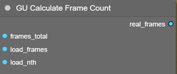  
Returns the integer count of real frames in a video, useful when frame skipping is configured at load time - e.g. for displaying the effective amount of work.
**frames_total** = total number of frames in the video
**load_frame** = requested number of frames to load
**load_nth** = load only every n-th frame in the sequence

# Concat Strings

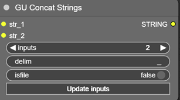  
Concatenates an arbitrary number of input strings with a configurable delimiter. The number of inputs is set via the **inputs** parameter followed by clicking **Update inputs**.
**delim** = separator character between concatenated strings; defaults to **`_`** for assembling a filename from multiple blocks.
**isfile** = flag that validates the resulting string as a filename. When enabled, forbidden characters are replaced with **`_`**, producing a safe string on output.
**!!! On old ComfyUI versions, spurious inputs `str_-2`, `str_-1`, `str_0` may appear - do not use them !!!**

# Extract Prompt

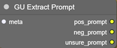  
Extracts prompts from the metadata of an incoming image (loaded, for example, by _Load Image with Metadata_, the input connects to `metadata_raw`). On output:
If the metadata contains nodes whose title or class name includes words like `prompt`, `encode`, `string`, `pos`, `neg`, etc. (including text-display nodes such as ShowText, which may contain the final combined prompt), the string content of those nodes is accumulated line-by-line into 3 blocks:  
**pos_prompt** = likely positive prompt
**neg_prompt** = likely negative prompt
**unsure_prompt** = strings that could not be classified unambiguously

# Get Media Input Name

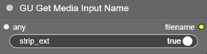  
Takes the filename (image, video, audio) from an upstream node. Can be connected to any loader output; reroutes are handled. By default the extension is stripped from the filename (**strip_ext**).
**The node always executes when the Queue runs.**  
**!!! There may currently be ordering issues when several such nodes exist in the same graph !!!**

# Get Model Filename

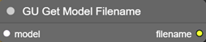  
Takes the model filename (.safetensor, .ckpt) from an upstream node. Can be connected to any loader output; reroutes are handled.  
**The node always executes when the Queue runs.**

# Get Node Active

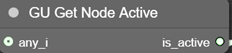  
Outputs the state of the upstream node - whether it is active or not.

# Get Sampler Indexed

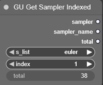  
Selects a sampler by index from the list of system samplers. Convenient in loops. The node returns a sampler reference, its name, and the list length (shown in the `total` field, indication only).

# Get Scheduler Indexed

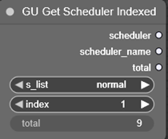  
Same as GU Get Sampler Indexed, but operates on schedulers.

# Image Label

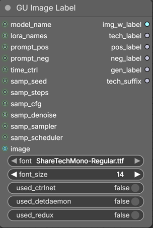  
From many input parameters (whose input names are self-explanatory) it assembles strings describing the generation's technical specs.  
**time_ctrl** = elapsed time in `hh:mm:ss` format, returned e.g. by *GU TimerOFF* (see below).  
The final image itself may also be fed in - the collected information will then be rendered as extra caption blocks at the bottom of the image. The caption's font face and size can be configured; the block height auto-adjusts to the text volume.
The node returns 4 specially-formatted text blocks:  
**tech_label** = hardware spec, including CUDA version, memory amounts, ... 
**pos_label** = positive prompt
**neg_label** = negative prompt
**gen_label** = generation parameters, including elapsed time
(timing via a *GU TimerON / GU TimerOFF* pair is recommended)
**tech_suffix** = short string indicating use of ControlNet, DetailDaemon, Redux - for use in
*GU Project Path*, as well as in the image caption

# Lora Randomizer

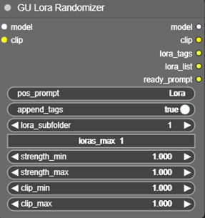  
Randomly loads LoRAs from the folder specified in **lora_subfolder** (only that folder itself is scanned, without child subfolders!). LoRAs and their weights are picked at random from the candidate list.  
**loras_max** = max number of LoRAs to load, up to 6 (if the folder contains fewer, it will load as many as it finds).
**strength_min, strength_max** = LoRA strength (-100..100, typically 0..1)
**clip_min, clip_max** = Clip strength (-100..100, typically 0..1)
Additional parameters **pos_prompt** and **append_tags** let you pass a source prompt and optionally append LoRA tags to it; the result is available on the **ready_prompt** output.
On output, in addition to the modified model and clip, it returns **lora_tags** - the string list of tags of the loaded LoRAs - and **lora_list** with the LoRA application parameters in the format `<lora:name:str:clp>`, where `str` = LoRA strength and `clp` = CLIP strength.
**The node always executes when the Queue runs.**

# Lora Stack Extended

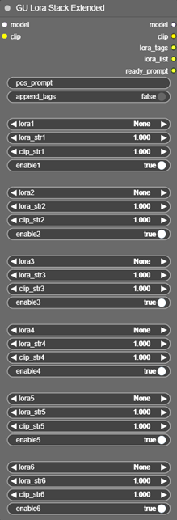  
Loads up to 6 individual LoRAs with independent LoRA and Clip strength control. The **enable** checkbox under each slot lets you disable a LoRA without losing its configured parameters.  
Additional parameters **pos_prompt** and **append_tags** let you pass a source prompt and optionally append LoRA tags to it; the result is available on the **ready_prompt** output.  
On output, in addition to the modified model and clip, it returns **lora_tags** - the string list of tags of the loaded LoRAs - and **lora_list** with the LoRA application parameters in the format `<lora:name:str:clp>`, where `str` = LoRA strength and `clp` = Clip strength.

# Motion Lora Stack

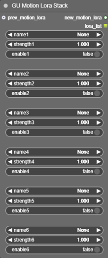  
Stack for animation LoRAs used by AnimateDiff (from the *__animatediff_motion_lora__* folder in the ComfyUI tree). Also returns the list of used LoRA names (for example, to inject into an info file or into the output video filename).

# Project Name

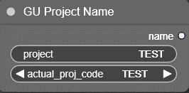  
Outputs the project code name. Can be entered manually in the **project** field, or picked from preset values in **actual_proj_codes**. List of the project codes stored in
*ComfyUI-GU_Nodepack\web\proj_codes.txt* 

# Project Path

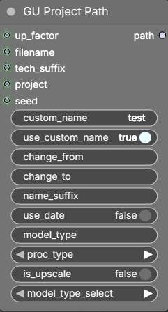  
Builds the base filename for saving an image or a video. Inside ComfyUI's `/output` folder, a folder is created whose name is taken from the **project** field (empty by default) and whose full path has the following shape:  
`[(work)/project/][_UP/][date/]name[_namesuffix][_upNx][_modeltype][_proctype][_techsuffix][_seed]_#####_.ext`  
(square brackets mark optional parts of the path - they are auto-included when the corresponding input values are present; darker color marks parameters that are driven directly from an input).  

When the **project** name is set, the path is built from `ComfyUI/output/(work)/project/`. In addition, both the project name and the filename block any subfolder splitting (`/` is replaced with **`_`**). If you need to specify a custom path of your own, leave **project** empty - the `(work)` folder is then not used, and a subfolder can be specified via **custom_name**.  
If the **is_upscale** flag is on, the folder `_UP/` is added to the path.  
If the **use_date** flag is on, the short date `YYYY_MM_DD/` is added to the path.  
The filename is either entered manually in **custom_name** (active when **use_custom_name** is on) or read from the **filename** input, to which a string from an upstream node is connected (e.g. from   *GU Get Media Input Name*).  
If part of the source name (custom or filename) needs to be replaced, **change_from** and **change_to** specify the substring to find and its replacement.  
**name_suffix** = string appended after the name, e.g. to add filename clarifications - can be automated via an upstream input.  
After the suffix, if **is_upscale** is on, `_upNx` is appended, where `N = up_factor`. The **up_factor** input takes a float upscale value (rounded up to an integer; values < 2 are ignored).  
After that, the following are appended:
* **model_type** - short label for the generative model type. Model codes are customizable here: *ComfyUI-GU_Nodepack\web\model_codes.txt*
* **proc_type** - generation process type: `text-2-image`, `image-2-image`, `inpaint`, ... It is recommended to omit this for upscales, since technically upscaling is also a distinct process but affects the path/name differently.  
* **tech_suffix** - extra info about the use of LoRA, ControlNet, DetailDaemon, Redux (preferably sourced from *GU Image Label*)  
* **seed** - added when the corresponding node input is connected

At the very end, the automatic index and the file extension are appended (not controlled from this node).
Example of a minimally-detailed path: `test_00001_.png`  
Example of a maximally-detailed path:
`(work)/TEST/_UP/2026_04_11/TEST_test_a_up3x_F1D_(used_loras_detdaemon)_00001_.png`  
Notes: the date is formatted in reverse order so that Explorer sorts correctly. The sequence number with a leading underscore is appended automatically by Comfy.  

# Resolution Select

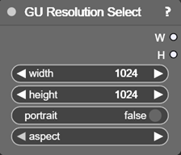  
Offers a wide choice of popular image and video resolutions, including Midjourney resolutions.  
The `portrait` toggle swaps the width/height on output, because the list only contains landscape formats (but the swap is also applied to manual entries - no extra check is performed!).

# Save Image Info

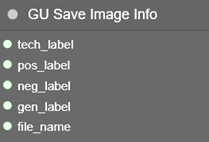  
Saves a TXT file to the path specified by **file_name** (it is recommended to feed it from *GU Project Path* so that the image and text file share the same name and live side by side). It also accepts the text blocks produced by *GU Image Label*: tech info, positive and negative prompts, and generation parameters.  
**The node always executes when the Queue runs.**

# Seed List

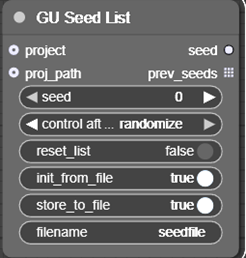  
Seed-value generator. Each value that differs from the previous one (i.e. not in `fixed` mode) is stored in the output list **prev_seeds**, and optionally appended line-by-line to a text file stored in ComfyUI's `output` folder (unless the `proj_path` input is provided - see below).  
**reset_list** = when enabled, the list is cleared on the next run and accumulation starts over. Ignored when `init_from_file` is on.  
**init_from_file** = activates loading the list of numbers from the file specified by `filename`. If the file is missing or the name is empty, the node starts from scratch.  
**store_to_file** = saves the output list to a file.  
**filename** = file name; worth changing per task, otherwise every node of this class would overwrite the same default `seedfile.txt`.  
**project** = optional input - connect the output of *GU Project Name*. The seed-file will then be saved under the same path as the generated images. If a string is entered manually, it must be a path to a file (not a folder), because the node expects a final-file path (designed to work with *GU Project Name*).  
**The node always executes when the Queue runs.**

# Set Frames Video

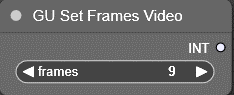  
Sets the frame count for video generation in LTX / WAN-style pipelines, where the count must follow the formula `N*8 + 1`.

# Sides Pack

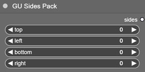  
Accepts 4 integers and packs them into a single tuple parameter that can be passed down the pipeline. Intended for outpaint, where it is convenient to set per-side padding in a single node.

# Sides Unpack

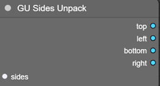  
Unpacks the integer tuple, restoring the individual values.

# String Lines

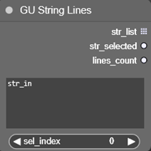  
Splits the multi-line input text **str_in** into separate lines, ignoring empty ones. Returns **str_list** - the list of effective (non-empty) lines - plus **str_selected** (the line chosen by **sel_index**) and **lines_count** (the number of lines in the list).

# String to Values

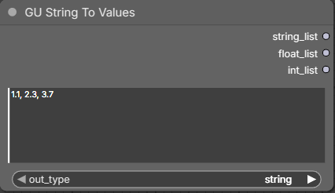  
Splits the input string into elements by delimiter. Returns a list of elements of different types depending on the chosen **out_type**.

# Switch Any by Index

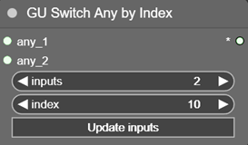  
Forwards the value of one of its inputs. The number of inputs is controlled by **inputs** (2 to 10; after changing the value, press **Update inputs**). The output data type matches the selected input. Accepts any data.  
Selection is driven by the **index** parameter (1 to 10). If the value is outside `1..inputs`, the nearest boundary input is used automatically.  
**!!! On old ComfyUI versions, spurious inputs `any_-1`, `any_0` may appear - do not use them !!!**

# Text Edit

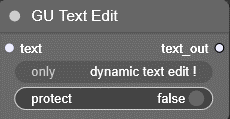  
Allows editing an incoming string: a string - e.g. one produced by image-to-text (i.e. not hand-edited) - is connected to the **text** field. After that, a field appears at the bottom of the node, containing the input text and letting you edit it. Suitable for tweaking auto-generated text. On every Queue (Run), the field is reset to the input value; the **protect** switch prevents this - when on, updates to the edited field from the incoming text are blocked.
**Works only with dynamic text!** The text is not preserved across workflow or ComfyUI restarts. **The first run populates the editable field; the second run forwards its content downstream.**  
**The node always executes when the Queue runs.**
**!!! Warning! Currently only one Text Edit node per graph can be reliably used !!!**

# TimerON

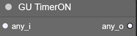  
Starts an internal time counter that will later be stopped and consumed by *TimerOFF*.  
**The node always executes when the Queue runs.**

# TimerOFF

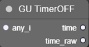  
Stops the internal timer started by *TimerON*, computes the elapsed time, and outputs it as a string in `hh:mm:ss` format. Also returns `time_raw` as an int in seconds.

# Turbo Lora

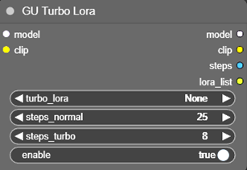  
Separately attaches an accelerating LoRA to the current incoming model. Also returns a variable step count (**steps**) depending on whether the LoRA is enabled, and a LoRA parameter string
(**lora_list**).
**turbo_lora** = the specific file to use  
**steps_normal** = default step count  
**steps_turbo** = step count when the LoRA is on  
**enable** = whether the LoRA is attached or not

---

**ComfyUI-GU_Nodepack/example** folder contains an example workflow (as well as a test image) to check the functionality of most nodes.

---

# License

This nodepack is released under the **MIT License** — see [LICENSE](LICENSE) for the full text.
Copyright (c) 2026 Alexander Guryev.

## Third-party credits

- **Share Tech Mono** (`fonts/ShareTechMono-Regular.ttf`) — font by Carrois Apostrophe, distributed under the [SIL Open Font License 1.1](fonts/OFL.txt). The license text ships alongside the font as required by OFL 1.1.
